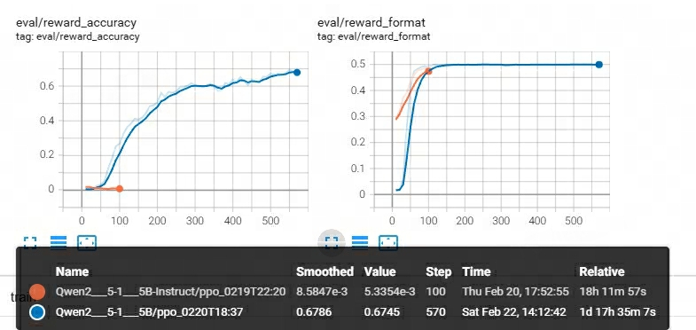

## Reproducing DeepSeek-R1-Zero
Reproducing deepseek-r1-zero using [OpenRLHF v0.5.9](https://github.com/OpenRLHF/OpenRLHF/tree/v0.5.9).

### Install
```
pip install -r requirements.txt
```

### Train on 2080ti x 4
Model `Qwen2.5-1.5B` + dataset `openai/gsm8k`
```
bash run_gsm8k.sh
```

Model `Qwen2.5-1.5B` + dataset `HuggingFaceH4/MATH`
```
bash run_huggingface_math.sh
```

### Result
#### openai/gsm8k

